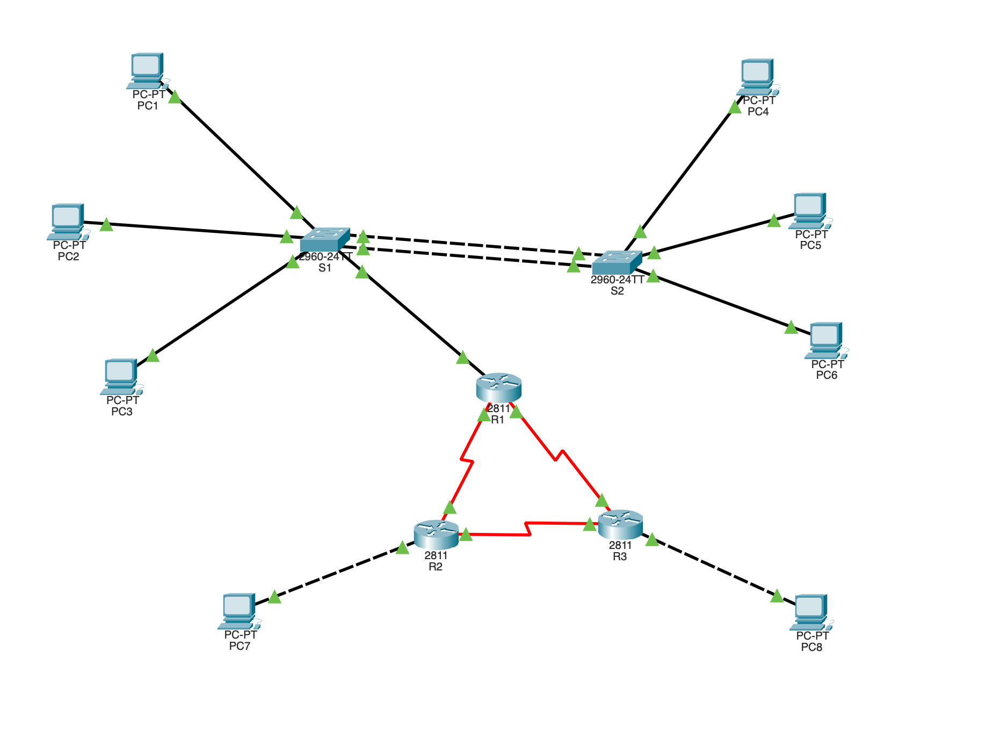
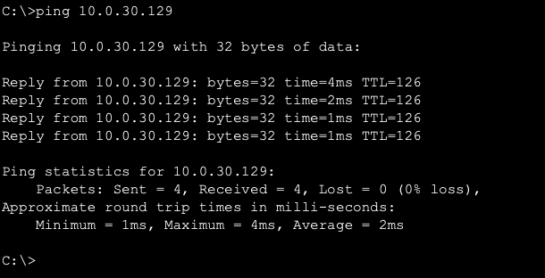
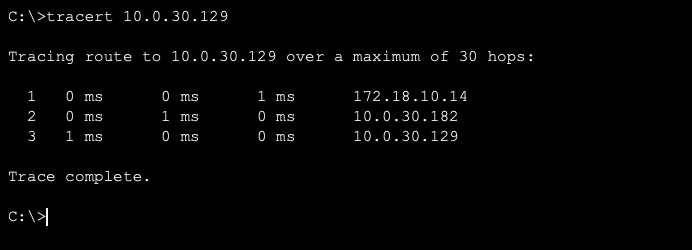
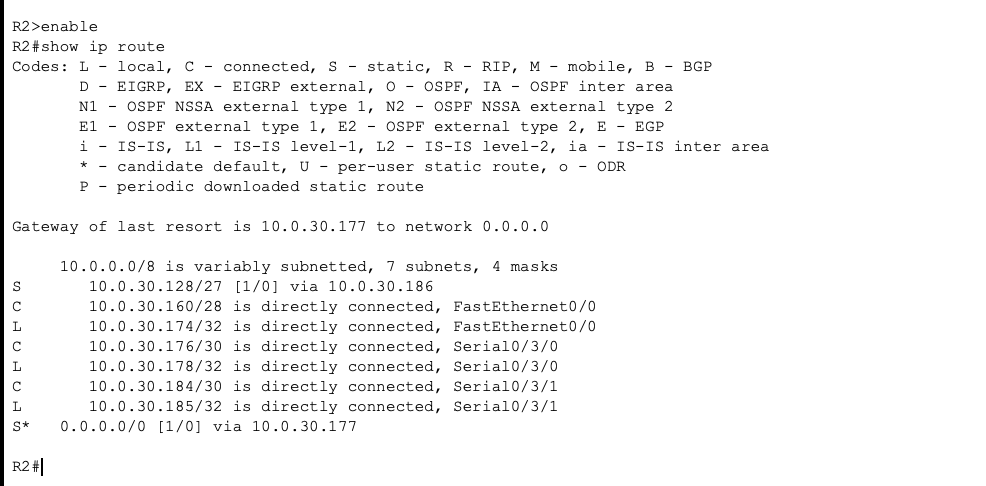

# 📡 Architecture Réseau d'Entreprise : Switching, Routing & WAN

> **Étudiant :** [Boustane Oussama](https://www.linkedin.com/in/oussama-boustane-22a990298/)  
> **Contexte :** Projet de Fin de Module (Casablanca, Janvier 2026)  
> **Sujet :** Conception d'une infrastructure multisites sécurisée et redondante.

---

## 📝 Description du Projet
Ce projet consiste en la conception et le déploiement d'une infrastructure réseau complète simulant un **Siège Social** connecté à deux **Sites Distants**.

L'objectif est de démontrer la maîtrise des protocoles avancés de **Commutation (Switching)**, de **Routage Inter-VLAN** et d'**Interconnexion WAN**, tout en respectant un cahier des charges strict (Segmentation, Haute Disponibilité, Optimisation IP).

---

## 🗺️ Topologie et Architecture

Le réseau s'articule autour d'une architecture hiérarchique comprenant une zone LAN (Distribution/Accès) et une zone WAN (Core).

### 📦 Inventaire du Matériel & Rôles
| Équipement | Modèle | Rôle Technique |
| :--- | :--- | :--- |
| **R1 (Siège)** | Cisco 2811 | **Cœur du réseau :** Assure le routage Inter-VLAN (RoaS) et la sortie WAN. |
| **R2 & R3** | Cisco 2811 | **Sites Distants :** Routeurs de bordure connectés via liaisons séries. |
| **S1 & S2** | Cisco 2960 | **Distribution/Accès :** Commutateurs gérant les VLANs et l'EtherChannel. |

### 🔢 Plan d'Adressage Clé (VLSM)
| Périphérique | Interface | IP / Masque | Description |
| :--- | :--- | :--- | :--- |
| **R1** | Fa0/0.10 | `172.18.10.14 /28` | Passerelle VLAN 10 (Utilisateurs) |
| **R1** | S0/3/0 | `10.0.30.177 /30` | Interface WAN vers R2 |
| **R3** | Fa0/0 | `10.0.30.158 /27` | Passerelle Site Distant 2 |
| **S2** | Vlan60 | `172.18.60.2 /28` | IP de Management (Admin) |

---

## ⚙️ Fonctionnalités Configurées

### 1. Commutation (Switching)
* **VLANs (802.1Q) :** Segmentation stricte en 5 réseaux logiques (10, 20, 30, 50 Natif, 60 Admin) pour la sécurité.
* **EtherChannel (LACP) :** Agrégation de 2 liens physiques entre S1 et S2 pour doubler la bande passante et assurer la redondance.
* **Sécurité Layer 2 :** Configuration des ports Trunk et Access avec restrictions des VLANs autorisés.

### 2. Routage (Routing)
* **Router-on-a-Stick :** Configuration de sous-interfaces sur R1 (`Fa0/0.10`, `.20`...) pour permettre aux VLANs de communiquer.
* **Routage WAN :** Liaisons séries point-à-point avec encapsulation HDLC.
* **Routage Statique :** Définition manuelle des routes pour garantir un chemin optimal entre le siège et les sites distants.

---

## 💻 Configurations IOS (Scripts)

Pour une transparence technique totale, les fichiers de configuration ("Running Config") des équipements principaux sont accessibles ici :

| Équipement | Type | Lien vers la config |
| :--- | :--- | :--- |
| **R1** | Routeur Central | [📄 Voir le script R1](configs/R1.txt) |
| **S1** | Switch Distribution | [📄 Voir le script S1](configs/S1.txt) |
| **R2** | Routeur WAN | [📄 Voir le script R2](configs/R2.txt) |
| **R3** | Routeur Distant | [📄 Voir le script R3](configs/R3.txt) |

---

## 🚀 Preuves de Fonctionnement & Analyse

### ✅ Test 1 : Connectivité End-to-End (Ping)
**Scénario :** Le PC1 (Siège) tente de joindre le PC8 (Site Distant R3).

> **Analyse :** Le succès du ping (`Reply from...`) avec un TTL de 126 confirme que le paquet a correctement traversé :
> 1. Le LAN du siège (VLAN 10).
> 2. Le routeur R1 (Routage Inter-VLAN).
> 3. La liaison WAN jusqu'à R3.

### ✅ Test 2 : Validation du Chemin (Traceroute)
**Scénario :** Analyse des sauts effectués par le paquet.

> **Analyse :** On observe clairement les 3 sauts logiques :
> * **Saut 1 :** Passerelle locale (`172.18.10.14`).
> * **Saut 2 :** Interface WAN d'entrée (`10.0.30.182`).
> * **Saut 3 :** Destination finale.
> Cela valide la configuration du **Routage Statique**.

### ✅ Test 3 : Table de Routage (R2)
**Scénario :** Vérification de la connaissance du réseau.

> **Analyse :** Le routeur R2 possède bien :
> * `C` : Ses réseaux connectés.
> * `S*` : Une route par défaut vers le cœur de réseau (Siège), essentielle pour le trafic sortant.

---

## 📂 Structure du Dépôt

* `projet_final.pkt` : Le fichier source Cisco Packet Tracer.
* `/configs` : Dossier contenant les scripts IOS (.txt).
* `topologie.png` : Vue d'ensemble de l'architecture.
* `ping.png` / `tracert.png` : Captures des tests de validation.

---
*Projet réalisé avec rigueur académique.*
